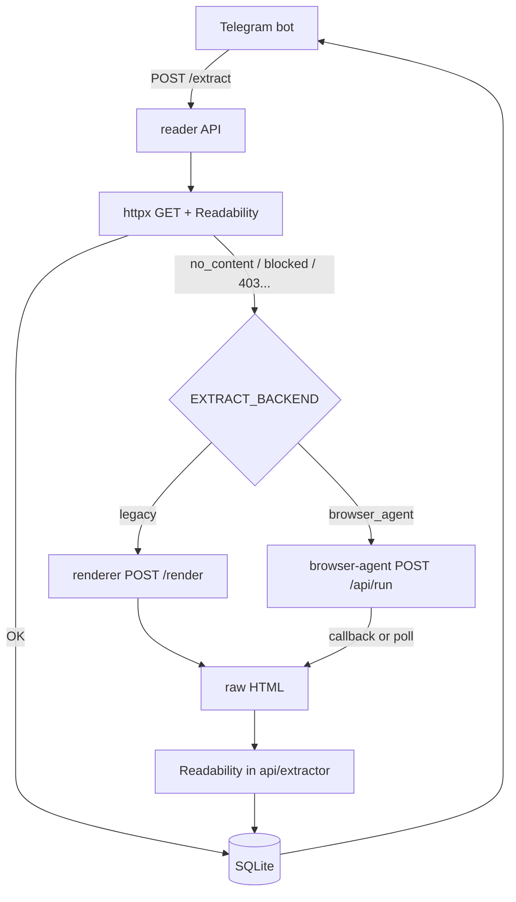

# План: інтеграція browser-agent (`get_page`) у reader-bot

**Статус:** planned  
**Дата:** 2026-05-28  
**Принцип:** існуючий пайплайн (`httpx` + `renderer`) **не чіпаємо**; додаємо другий fallback через `browser-agent`, вибір — env.

**Джерело контракту:** [browser-agent/docs/discovery-api.md](../../androidFarm/browser-agent/docs/discovery-api.md) (версія з in-process queue, `callback_context`, персистентні tasks).

---

## 1. Цілі

| Ціль | Як |
|------|-----|
| Підключити `generic/get_page` з browser-agent | `POST /api/run` + callback (+ poll fallback) |
| Не ламати поточну поведінку | `EXTRACT_BACKEND=legacy` за замовчуванням |
| Перемикання без зміни коду | env у `api` |
| Бот без змін логіки | лишається `POST /extract` |
| Readability / БД / формати | без змін після отримання HTML |

---

## 2. Архітектура



**Два режими fallback (після швидкого httpx):**

| `EXTRACT_BACKEND` | Fallback |
|-------------------|----------|
| `legacy` (default) | `RENDERER_URL` → `POST /render` (як зараз) |
| `browser_agent` | `BROWSER_AGENT_URL` → `get_page` |

Швидкий шлях **завжди** `httpx` — незалежно від env.

---

## 3. Змінні середовища

### 3.1 Перемикач

```env
# legacy | browser_agent
EXTRACT_BACKEND=legacy
```

### 3.2 Legacy (існуючі, без змін)

```env
RENDERER_URL=http://renderer:8001
RENDER_TIMEOUT=120
```

### 3.3 Browser-agent (нові)

```env
BROWSER_AGENT_URL=http://browser-agent:3003
BROWSER_AGENT_API_KEY=<той самий X-API-Key що на агенті>

# URL, з якого агент стукає в reader API (Docker DNS / tunnel)
PARSER_CALLBACK_BASE_URL=http://api:8000
PARSER_CALLBACK_SECRET=<random-long-secret>

# Очікування результату (сек) — менше за timeout бота (130s)
PARSER_WAIT_TIMEOUT_SEC=110
PARSER_POLL_INTERVAL_SEC=2

# get_page input
PARSER_INCLUDE_HTML=true
PARSER_MAX_BYTES=500000
# опційно: PARSER_FORCE_TIER=playwright
```

### 3.4 На browser-agent (dev Docker)

```env
CALLBACK_ALLOW_HTTP=true
CALLBACK_ALLOW_PRIVATE=true
MAX_CONCURRENT_TASKS=3
TASK_TIMEOUT_MS=120000
```

---

## 4. Файли та зміни

| Файл | Дія |
|------|-----|
| `api/extractor.py` | Рефактор: `_fallback_or_raise` → делегат за `EXTRACT_BACKEND` |
| `api/browser_agent.py` | **Новий:** клієнт `get_page`, callback registry, poll fallback |
| `api/main.py` | **Новий endpoint:** `POST /internal/parser-callback` |
| `api/pending_extracts.py` | **Новий (опційно):** `extract_id → asyncio.Future` + TTL cleanup |
| `.env.example` | Документація env |
| `docker-compose.yml` | Env для `api`; `depends_on: renderer` лишити (legacy працює) |
| `README.md`, `CLAUDE.md` | Розділ про два бекенди |
| `bot/bot.py` | **Без змін** (або +1 ключ `err_parser_unavailable` — опційно) |
| `i18n/*.json` | Опційно: `err_parser_unavailable` |

**Не чіпаємо:** `renderer/`, `converter.py`, `telegram_view.py`, `db.py`, `extension/`.

---

## 5. Деталі реалізації

### 5.1 `api/browser_agent.py`

**Функція:** `async def fetch_html_via_get_page(url: str, extract_id: str) -> str`

1. `POST {BROWSER_AGENT_URL}/api/run`  
   - Header: `X-API-Key: BROWSER_AGENT_API_KEY`  
   - Body:

```json
{
  "platform": "generic",
  "action": "run_scenario",
  "params": {
    "scenario": "get_page",
    "input": {
      "url": "<url>",
      "includeHtml": true,
      "includeText": false,
      "maxBytes": 500000
    }
  },
  "callback_url": "{PARSER_CALLBACK_BASE_URL}/internal/parser-callback",
  "callback_headers": { "Authorization": "Bearer {PARSER_CALLBACK_SECRET}" },
  "callback_context": { "extractId": "<extract_id>" }
}
```

2. Отримати `task_id` з `202`.

3. **Очікування (callback-first):**
   - Зареєструвати `extract_id → Future` перед POST.
   - `await asyncio.wait_for(future, PARSER_WAIT_TIMEOUT_SEC)`.
   - Callback endpoint резолвить Future з `html` або exception.

4. **Poll fallback** (якщо callback не прийшов / Future timeout близький до кінця):
   - `GET /api/tasks/{task_id}` кожні `PARSER_POLL_INTERVAL_SEC`.
   - `status == completed` → `task.result.html`.
   - `status == failed` → `task.error` → `ExtractError`.
   - `pending` / `running` — чекати далі.

5. Валідація: порожній `html`, `_looks_blocked(html)` → `ExtractError("blocked")`.

### 5.2 `api/main.py` — callback

```
POST /internal/parser-callback
Authorization: Bearer <PARSER_CALLBACK_SECRET>
Body: { chunkType, finished, html?, error?, context?, ... }
```

| `chunkType` | Дія |
|-------------|-----|
| `done` + `finished: true` | `context.extractId` → `future.set_result(html)` |
| `error` + `finished: true` | `future.set_exception(...)` |
| інші | `200 OK`, ігнор (або лог) |

Не блокувати відповідь — швидко `200`, щоб агент не тримав retry даремно.

### 5.3 `api/extractor.py`

```python
EXTRACT_BACKEND = os.getenv("EXTRACT_BACKEND", "legacy").strip().lower()

async def _fallback_or_raise(url, original):
    if EXTRACT_BACKEND == "browser_agent":
        if not BROWSER_AGENT_URL:
            raise original
        try:
            html = await fetch_html_via_get_page(url, extract_id=uuid4())
            ...
        except Exception:
            raise original  # або прокинути ExtractError — узгодити в тестах
    # legacy (default)
    ... існуючий _render_via_browser ...
```

**Важливо:** гілка `legacy` — **копія поточної логіки без змін поведінки**.

### 5.4 In-memory registry

- `dict[str, asyncio.Future]` + `asyncio.Lock`.
- TTL: при timeout — `pop` + cleanup task кожні N хв (забути «завислі» Future).
- `concurrent_updates` у боті → окремий `extract_id` на кожен `/extract`.

---

## 6. Мапінг помилок → UX

| Джерело | `ExtractError` / HTTP |
|---------|------------------------|
| `get_page` `success: false`, CF у html | `blocked` |
| немає html / мало тексту після Readability | `no_content` |
| timeout wait/poll | `timeout` (існуючий `err_timeout`) |
| browser-agent недоступний | fallback на `original` (як renderer down) або `err_request` |
| `task.error` з агента | лог + `no_content` / `blocked` за ключовими словами |

Нові i18n-ключі — **тільки якщо** потрібен окремий текст; інакше перевикористати `err_blocked`, `err_timeout`, `err_request`.

---

## 7. Docker / compose

**Мінімум (перемикання env):**

- `api` отримує нові env; `renderer` лишається для `legacy`.
- browser-agent крутиться **окремо** (інший репо/compose) — у `BROWSER_AGENT_URL` вказати reachable host.

`depends_on: renderer` не прибирати — інакше `legacy` зламається.

---

## 8. Етапи робіт

### Етап 1 — Каркас (без зміни default)

- [ ] `api/pending_extracts.py`
- [ ] `api/browser_agent.py` (POST run + poll only, без callback)
- [ ] `EXTRACT_BACKEND` у `extractor.py`, гілка `browser_agent` викликає poll
- [ ] `.env.example`, README

**Критерій:** `EXTRACT_BACKEND=browser_agent` парсить простий URL; `legacy` — як раніше.

### Етап 2 — Callback

- [ ] `POST /internal/parser-callback` у `main.py`
- [ ] callback-first у `browser_agent.py`, poll як fallback
- [ ] `callback_headers` + `callback_context`

**Критерій:** результат приходить через callback; poll лише якщо callback не дійшов.

### Етап 3 — Надійність

- [ ] Мапінг помилок, логування `task_id` / `extract_id`
- [ ] Узгодити таймаути: bot 130s ≥ `PARSER_WAIT_TIMEOUT` + запас
- [ ] Cleanup registry, обробка duplicate callback

### Етап 4 — Документація та rollout

- [ ] `CLAUDE.md`, `README.md`
- [ ] Чекліст тестів (розділ 9)
- [ ] Staging: `EXTRACT_BACKEND=browser_agent`, prod лишає `legacy` до перевірки

---

## 9. Тест-план

| # | `EXTRACT_BACKEND` | URL | Очікування |
|---|-------------------|-----|------------|
| 1 | `legacy` | статична стаття | як зараз |
| 2 | `browser_agent` | статична стаття | стаття в боті |
| 3 | `browser_agent` | JS/SPA | fallback, контент є |
| 4 | `browser_agent` | Cloudflare | `err_blocked` або успіх |
| 5 | `legacy` | той самий CF | порівняння з п.4 |
| 6 | `browser_agent` | агент вимкнений | graceful (як renderer down) |
| 7 | паралельно 2 URL | 2 юзери | без плутанини `extract_id` |
| 8 | callback вимкнений (firewall) | — | poll дістає `task.result.html` |
| 9 | рестарт api під час extract | — | timeout, без зависання бота |

---

## 10. Rollout

1. Деплой коду з **`EXTRACT_BACKEND=legacy`** (zero risk).
2. Підняти browser-agent, перевірити мережу callback (`CALLBACK_ALLOW_*`).
3. На staging: `EXTRACT_BACKEND=browser_agent`.
4. Порівняти `/failed` адміна — які сайти ламаються в кожному режимі.
5. Prod switch коли стабільно.

---

## 11. Ризики

| Ризик | Мітигація |
|-------|-----------|
| Черга агента (`pending`) | таймаут + poll; `MAX_CONCURRENT_TASKS` |
| Callback не доходить | poll fallback; моніторинг DLQ агента |
| Великий `html` у пам’яті | `maxBytes` у get_page |
| Два бекенди роз’їхались | env switch, не видаляти legacy |
| Дока каже `result` для get_page, callback без `html` у done | перевірити на staging реальний payload `done` |

---

## 12. Що свідомо не робимо в v1

- Видалення `renderer` сервісу
- Зміна контракту `/extract` для бота/extension
- `EXTRACT_BACKEND=both` (подвійний fallback renderer → browser_agent) — можна v2
- Синхронний `/api/v2/run` (deprecated на browser-agent)

---

## 13. Підсумок

| Компонент | Зміни |
|-----------|--------|
| **bot** | 0 |
| **api** | +2–3 модулі, callback route, env switch у `extractor` |
| **renderer** | 0 |
| **browser-agent** | лише конфіг/мережа |
| **default** | `EXTRACT_BACKEND=legacy` |

---

## Довідка: оновлення browser-agent API (2026-05-27)

- `POST /api/run` → `202 { task_id }`, задача в черзі (`pending` → `running`).
- `callback_headers`, `callback_context` (echo в кожному chunk як `context`).
- `GET /api/tasks/:task_id` — персистентний статус; для `get_page` після завершення — `task.result.html`.
- `GET /api/tasks/:task_id?include=chunks` — для discovery-сценаріїв.
- Не використовувати `/api/v2/run`.
